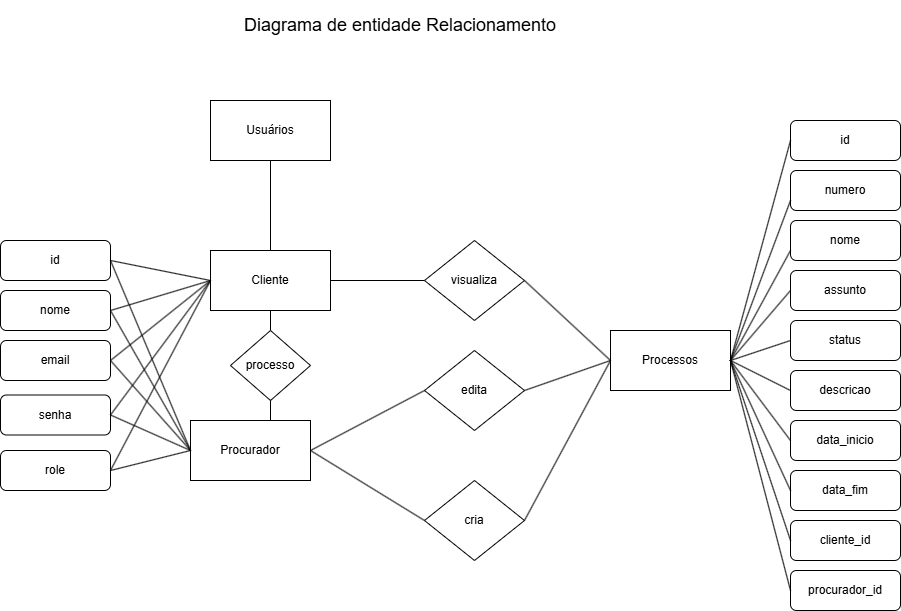

Sistema de Gerenciamento de Processos Jurídicos:

Este projeto é uma aplicação web de gerenciamento de processos jurídicos, permitindo que procuradores e clientes interajam com processos de acordo com suas permissões. O sistema foi desenvolvido utilizando Node.js no back-end, MySQL para o banco de dados e React.js no front-end.

Tecnologias Utilizadas:

Node.js: Ambiente de execução JavaScript no servidor.

Express.js: Framework para Node.js utilizado para criar a API RESTful.

MySQL: Banco de dados relacional utilizado para armazenar informações sobre processos, usuários e clientes.

jsonwebtoken (JWT): Para autenticação de usuários e geração de tokens.

cors: Middleware para permitir solicitações de origens diferentes.

body-parser: Middleware para facilitar o parseamento de dados enviados no corpo das requisições HTTP.

React.js: Framework JavaScript para construção de interfaces de usuário interativas.

React Router DOM: Para gerenciamento de rotas no front-end.

Axios: Cliente HTTP para fazer requisições à API.

CSS: Estilização personalizada para o layout.

Figma: Ferramenta usada para criar o protótipo de alta fidelidade da interface do usuário.
(link figma: https://www.figma.com/design/nluniJ6Y9UuweXIa6MDXtr/Prova--Front-end?node-id=0-1&t=I5gqQcaOELPw76KE-1)
Postman: Usado para testar e validar as rotas da API.

Exemplo de Login
Para testar o sistema, você pode usar o seguinte usuário para login:
Email: lorena@admin.com
Senha: 123456

Como Configurar
Clone este repositório para o seu ambiente local:
bash
Copiar código
git clone https://github.com/seu-usuario/projeto-gestao-processos.git

Registrar um Novo Usuário

 POST /register

 Registra um novo usuário (cliente ou procurador).

{
  "nome": "John Doe",
  "email": "johndoe@example.com",
  "senha": "12345",
  "role": "cliente"
}

Login de Usuário

 POST /login

 Realiza o login do usuário e retorna um token JWT.

{
  "email": "johndoe@example.com",
  "senha": "12345"
}
 Exemplo de Login:

 Para testar o login, use o seguinte usuário:

 
{
  "email": "lorena@admin.com",
  "senha": "123456"
}

Gerenciamento de Processos

 POST /processos

 Cria um novo processo. Somente procuradores podem criar processos.

{
  "numero": "12345",
  "nome": "Processo de Exemplo",
  "assunto": "Assunto do processo",
  "status": "Em andamento",
  "descricao": "Descrição detalhada do processo",
  "data_inicio": "2025-01-01",
  "data_fim": "2025-12-31",
  "cliente_id": 1
}
 GET /processos

 Lista os processos do usuário logado (clientes ou procuradores).

 GET /processos/{id}

 Obtém os detalhes de um processo específico. Acesso restrito para clientes ou procuradores associados ao processo.

 Parameters:
id (path): ID do processo.
PUT /processos/{id}

 Atualiza um processo. Somente o procurador que criou o processo pode editá-lo.

{
  "nome": "Processo de Exemplo Atualizado",
  "descricao": "Descrição atualizada do processo",
  "data_inicio": "2025-01-01",
  "data_fim": "2025-12-31",
  "cliente_id": 1
}
 DELETE /processos/{id}

 Exclui um processo. Somente o procurador que criou o processo pode excluí-lo.

 Parameters:
id (path): ID do processo.
Middleware de Autenticação e Autorização

 authenticateToken (Middleware)

 Esse middleware é usado para autenticar as requisições usando o JWT (JSON Web Token). Ele verifica se o token enviado no cabeçalho da requisição é válido e se o usuário está autenticado.

 Funcionamento: O token é esperado no cabeçalho Authorization da requisição: Authorization: Bearer {token}. Se o token for válido, o usuário será autenticado e poderá acessar as rotas protegidas. Se o token for inválido ou não enviado, a requisição será negada.

 authorizeRole (Middleware)

 Esse middleware é usado para verificar se o usuário tem a permissão necessária para acessar a rota. Ele verifica se o papel do usuário (role) corresponde ao especificado.

Considerações Finais
Essa documentação descreve as rotas essenciais da API de gerenciamento de processos jurídicos. Ela utiliza autenticação JWT para garantir que apenas usuários autenticados possam acessar os dados, e também faz uso de permissões para garantir que apenas os usuários apropriados possam criar, editar e excluir processos.
A API foi desenvolvida com o objetivo de permitir que tanto clientes quanto procuradores interajam com os processos de forma controlada, garantindo que cada ação tenha o nível de permissão adequado.
A documentação foi construída usando o Swagger e pode ser acessada no endpoint /api-docs do servidor.

Funcionalidades extras a serem colocadas Futuramente:
-criptografia com o bcryptjs;
-Filtrar processos separadamente;
-Distribuição de processos para outro procurador;
-Anexar ou desanexar documentos aos processos;
Consultar e visualizar processos de outros procuradores.

